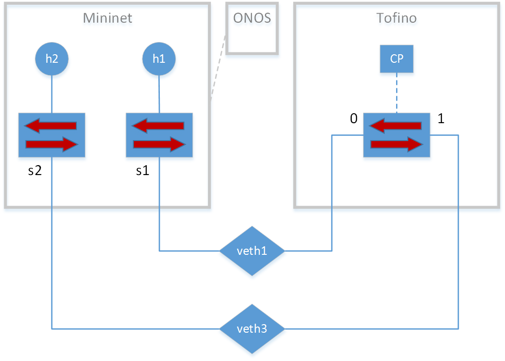

# P4Simtool

## Summary

This document describes the architecture and operation of the P4Simtool, a simulation/emulation platform created to combine Tofino Network Architecture (TNA) and bmv2 P4 architectures. The [NGSDN tutorial](https://github.com/opennetworkinglab/ngsdn-tutorial) developed by the ONF is the basis of this emulation tool. This is the [repo](https://github.com/daviddvs/ngsdn-tutorial/) that contains the code.
**Note**: to successfully run this code you must be in a host inside the I2T network.

## Architecture

The architecture is based on the NGSDN tutorial, which uses Docker to build Mininet and ONOS containers. I extended this architecture to add an additional Tofino container that runs the tofino-model. 

 



                                                                       P4Simtool architecture

## Operation

Use the following commands to download and start P4Simtool 

```bash
git clone https://github.com/daviddvs/ngsdn-tutorial.git
cd ngsdn-tutorial
git checkout tofino

# Edit bmv2 P4 code -> ./p4src/main.p4
# Edit ONOS app code -> ./app/src/main/java/org/onosproject/ngsdn/tutorial/*
# Edit Tofino P4 code -> ./tofino/switch.p4
# Edit Mininet topology -> ./mininet/topo-v6-tofino.py
# Edit netcfg -> ./mininet/netcfg-tofino.json
make app-build # build ONOS app and bmv2 P4 code
make start # wait for 40s to start ONOS
make app-reload
make netcfg
util/mn-cmd h1 ping -c 1 2001:1:1::2
util/mn-cmd h2 ping -c 1 2001:1:1::1
make app-reload
util/mn-cmd h1 ip -6 neigh replace 2001:1:1::2 lladdr 00:00:00:00:00:20 dev h1-eth0
util/mn-cmd h2 ip -6 neigh replace 2001:1:1::1 lladdr 00:00:00:00:00:10 dev h2-eth0

# Access CLIs and logs:
make onos-log # type exit
make mn-cli # type ctrl+d
make tofino-log # type exit
make tofino-cli # type exit
make tofino-bash # type exit
```

## Conclusions

The ONOS CP is the Ipv6SimpleRoutingComponent, which is not correctly integrated with NDP/ARP components.

The performance of the simulation tool is downgraded (throughput of 2-3 Mbps) mainly due to the tofino-model, which was originally created for debugging purpose.